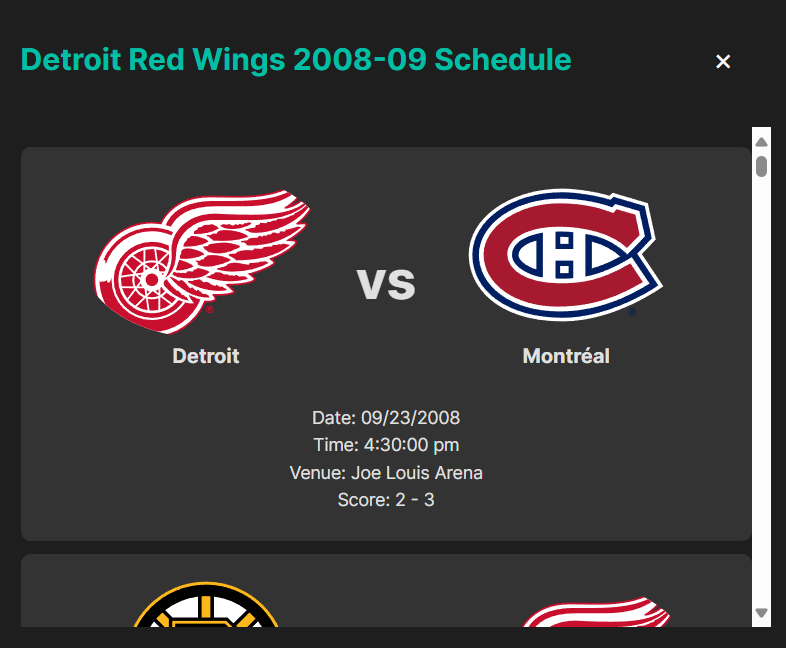

# NHL Stats Application

Welcome to the NHL Stats application, your go-to app for exploring and comparing the latest NHL statistics. Dive into league summaries, compare stats, and stay updated with all the latest data.

## Features

1. **League Summary Page**
   - **Sorting and Comparing Teams**: Easily sort and compare teams using interactive Bar and Radar charts. The charts provide a visual representation of team statistics, making it easier to analyze performance.
   - **Bar Chart and Radar Chart**: The Bar chart helps in comparing the teams based on various parameters while the Radar chart provides a normalized comparison of the selected teams.

2. **Team Statistics Page**
   - **Multiple Dropdown Selection**: Select the team, season, and game type (Regular Season or Playoffs) from the dropdown menus to view the specific statistics.
   - **Grid View and Table View**: View team statistics in either a visually appealing Grid view or a detailed Table view. The Grid view displays player cards, and the Table view organizes player statistics in a tabular format.
   - **Player Search**: Click on a player card to search for the player on Google, providing quick access to more detailed information.

3. **Team Schedule**
   - **Show Team Schedule**: View the schedule and results of a team for a particular year. The schedule displays game dates, times, venues, and scores, providing a comprehensive view of the team's performance throughout the season.

## Screenshots

### Hero Page


### League Summary Page


### League Summary Page (Compare Teams)


### Team Statistics Page (Grid View)


### Team Statistics Page (Table View)


### Team Schedule Modal


## Running the Application

Follow these steps to run the NHL Stats application locally:

### Prerequisites

- Node.js (v14 or higher)
- npm (v6 or higher)

### Installation

1. **Clone the repository:**

    ```bash
    git clone https://github.com/akskola/nhl-stats.git
    cd nhl-stats
    ```

2. **Install dependencies:**

    ```bash
    npm install
    ```

3. **Start the development server:**

    ```bash
    npm start
    ```

4. **Open the application:**

    Open your browser and go to [http://localhost:3000](http://localhost:3000) to see the application in action.

### Build for Production

To build the app for production, run:

```bash
npm run build
```

### License
This project is licensed under the MIT License. See the LICENSE file for details.

This application is built for learning purposes. I do not own the rights to the images displayed in the web app.
